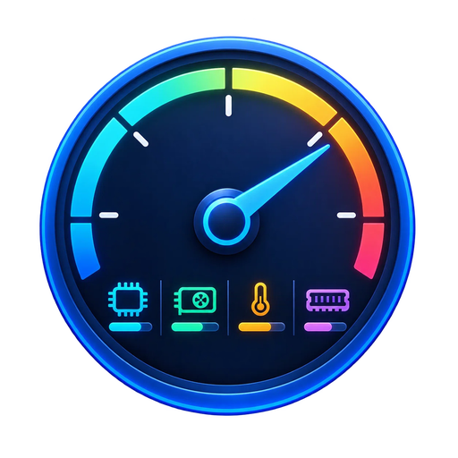

# StatsOSD



**版本：v1.1.0** ｜ [下载最新版](https://github.com/Alooshy0827/StatsOSD/releases/latest) ｜ Windows 10/11 x64 ｜ [许可：专有软件](LICENSE)

透明置顶、鼠标穿透的硬件监控小面板，常驻屏幕角落，实时显示 CPU / GPU / 内存的**温度、功耗、负载、频率、显存**等指标（类似微星小飞机的监控叠加层）。

## 功能

- **13 项可选指标**：CPU 温度/功耗/占用/频率 · GPU 温度/功耗/占用/热点/频率/显存/风扇 · 内存占用%/已用 GB，勾选即显示、顺序即排列
- **布局预设**：迷你（单行）/ 标准（分组分行）/ 详细（每指标一行带完整名称）
- **全局字体**：字号四档（小/中/大/特大）+ **字体描边**（默认开启，实心描边，背景全透明也能看清）
- **温度分级着色**：CPU 80–89° 橙、≥90° 红；GPU 75–82° 橙、≥83° 红
- **外观**：半透明圆角面板，背景不透明度 0–100% 可调；四角预设或**自由拖动**到任意位置
- **鼠标穿透**：不挡游戏操作；**强制置顶**：压制其他置顶窗口（独占全屏游戏无效）
- **稳定性**：传感器采样在后台线程（界面不会因驱动卡顿冻结）+ 采样看门狗 + 单实例保护 + 日志轮转
- **托盘菜单**分 5 组；小图标可放任务栏常显区或 `^` 溢出区
- **开机自启**：管理员模式下创建计划任务，登录即启动且**免 UAC 弹窗**

> 新安装默认：**背景 50% 透明度 · 标准布局 · 中号字体 · 字体描边开启**（都可在托盘菜单里改）

## 运行

1. 解压 `StatsOSD-v1.1.0-win-x64.zip`，双击 `StatsOSD.exe`
2. 需要 **.NET 8 桌面运行时**（[下载](https://dotnet.microsoft.com/download/dotnet/8.0)）
3. 建议**以管理员身份运行**——CPU 温度与功耗需要底层传感器读取，程序会自动释放 `StatsOSD.sys`（仅用于读取硬件寄存器）

> 托盘菜单的「以管理员重启」**始终可用**：未提权时点击会弹 UAC 提升权限；已经是管理员时点击则原样重启一次（不会弹 UAC）。

## 托盘菜单

| 组 | 项目 |
| --- | --- |
| 主操作 | 隐藏 / 显示 OSD |
| 二级界面 | 预设面板位置（四角）· **拖动调整位置** · **显示内容**（13 项指标勾选）· **布局预设**（迷你/标准/详细）· **字体大小**（小/中/大/特大）· **字体描边** · 图标位置（托盘常显区 / 溢出区）· 透明度 |
| 开关 | 鼠标穿透 · 强制置顶 · 开机自启 |
| 工具 | 导出传感器 · 重启资源管理器 |
| 权限与退出 | 以管理员重启（始终可用） · 退出 |

设置文件 `%APPDATA%\StatsOSD\settings.json`｜日志 `%TEMP%\statsosd.log`

## 命令行参数

```
StatsOSD.exe --shot      D:\temp\panel.png    # 面板自渲染截图（排版自检）
StatsOSD.exe --dump      D:\temp\sensors.txt  # 导出全部硬件/传感器清单
StatsOSD.exe --iconshot  D:\temp\ico.png      # 导出实际使用的托盘图标
StatsOSD.exe --demo --shot D:\temp\p.png      # 用合成数据截图（验证配色）
StatsOSD.exe --autostart on                   # 开机自启：on / off / status
StatsOSD.exe --traypos   promoted             # 托盘位置：promoted / overflow / status
```

## 技术栈

C# / WPF（.NET 8），传感器读取由 [LibreHardwareMonitor](https://github.com/LibreHardwareMonitor/LibreHardwareMonitor) 完成。

## 许可

**专有软件，保留所有权利（All Rights Reserved）** —— 详见 [LICENSE](LICENSE)。

未经作者书面许可，不得复制、修改、分发或用于商业用途。欢迎通过 Issue 反馈问题、通过 Pull Request 提交建议。
